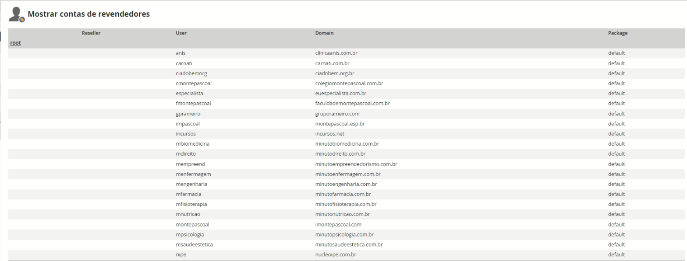

# BACKUP MP - WHM - system/db

## Relatório Geral
Foram realizado os backups de modo manual de **19 sistemas** e **18 base** de dados sql.  
Todos os backups foram salvos nos discos indicados pela Deltta e especificados no detalhamento neste documento.  

Foi reestruturado e reconfigurado o sql e dump do servidor WHM para permitir o backup das base de dados pelo script sh.  
Obs.: O funcionamento do script não foi alterado, apenas o diretório de destino dos novos backups
- Nova pasta:   root@server:~/backup/NEW_bkp_mysql  

**Sugestão**:
Seria bom fazer bkp dos arquivos do sistema, todos anexos deles vao para pasta do sistema, e termos o banco e nao termos os anexos do sistema vai que qse tornar o bkp do banco nulo;
Pastas:
- /home
  - Cada pasta aqui, representa um usuário com sistema/site
  - Todos arquivos para cada usuário são importantes para restauração em novo servidor
  - Em anexo, temos a lista dos websites, é importante fazer o backup para cada usuário listado na imagem
  

> ### ====== SYSTEM ==========================================  
  
#### == \\172.16.50.20\BKP_MP\SYSTEM (backup_msql)  

| Tipo | Nome           | Dominio do sistema            |
| ---- | -------------- | ----------------------------- |
| ZIP  | anis           | clinicaanis.com.br            |
| ZIP  | carnati        | carnati.com.br                |
| ZIP  | ciadobemorg    | ciadobem.org.br               |
| ZIP  | cmontepascoal  | colegiomontepascoal.com.br    |
| ZIP  | especialista   | euespecialista.com.br         |
| ZIP  | fmontepascoal  | faculdademontepascoal.com.br  |
| ZIP  | gprameiro      | gruporameiro.com              |
| ZIP  | impascoal      | montepascoal.esp.br           |
| ZIP  | mbiomedicina   | minutobiomedicina.com.br      |
| ZIP  | mdireito       | minutodireito.com.br          |
| ZIP  | mempreend      | minutoempreendedorismo.com.br |
| ZIP  | menfermagem    | minutoenfermagem.com.br       |
| ZIP  | mengenharia    | minutoengenharia.com.br       |
| ZIP  | mfisioterapia  | minutofisioterapia.com.br     |
| ZIP  | mnutricao      | minutonutricao.com.br         |
| ZIP  | mfarmacia      | minutofarmacia.com.br         |
| ZIP  | msaudeestetica | minutosaudeestetica.com.br    |
| ZIP  | mpsicologia    | minutopsicologia.com.br       |
| ZIP  | nipe           | nucleoipe.com.br              |
****

#### == \\172.16.50.20\BKP_MP\SYSTEM (backup_msql)   
  
| Tipo  | Nome         | Dominio do sistema |
| ----- | ------------ | ------------------ |
| FILES | montepascoal | imontepascoal.com  |
| FILES | incursos     | incursos.net       |
****

#### == \\172.16.50.20\BKP_MP\SYSTEM (backup)  
  
| Tipo | Nome         | Dominio do sistema |
| ---- | ------------ | ------------------ |
| ZIP  | montepascoal | imontepascoal.com  |
| ZIP  | incursos     | incursos.net       |
****

> ### ====== DATABASE ========================================  
  
#### == \\172.16.50.20\BKP_MP\SQL (backup_msql)  

| Tipo | Nome                                |
| ---- | ----------------------------------- |
| SQL  | anis_qrcode0.sql                    |
| SQL  | fmontepascoal_wp.sql                |
| SQL  | gprameiro_app_v3.sql                |
| SQL  | gprameiro_app_v3_log.sql            |
| SQL  | gprameiro_app_v3_login_register.sql |
| SQL  | gprameiro_rameiro.sql               |
| SQL  | gprameiro_rameiro_homologacao.sql   |
| SQL  | gprameiro_rameiro_novo.sql          |
| SQL  | incursos_apprameiro.sql             |
| SQL  | mbiomedicina_nucleoipe.sql          |
| SQL  | menfermagem_nucleoipe.sql           |
| SQL  | mengenharia_nucleoipe.sql           |
| SQL  | mfarmacia_nucleoipe.sql             |
| SQL  | mfisioterapia_nucleoipe.sql         |
| SQL  | mnutricao_nucleoipe.sql             |
| SQL  | montepascoal_apprameiro.sql         |
| SQL  | mpsicologia_nucleoipe.sql           |
| SQL  | msaudeestetica_nucleoipe.sql        |
****
